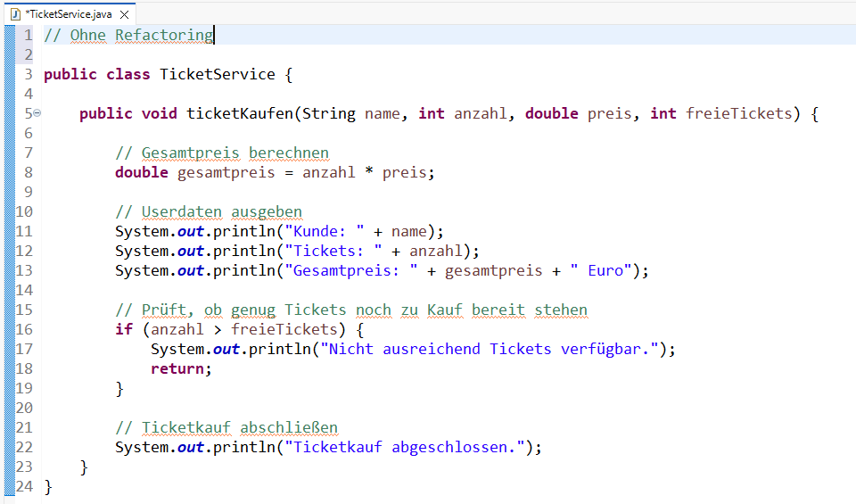
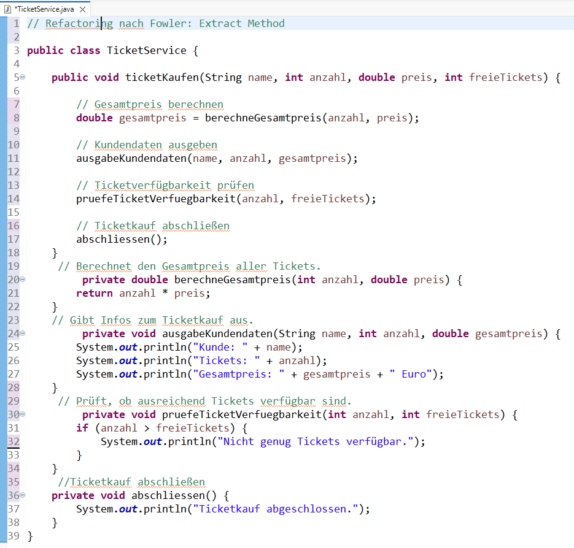

# Refactoring

## 1. Ausgewählte Refactorings von Fowler

### 1.1 Extract Method
Finde ich selbst toll, weil die Lesbarkeit von Code auch durch kleine Änderungen schon verbessert wird. 
Ergo wereden lange Methoden hier in kleinere aufgeteilt, damit wird der Code verständlicher, wartbarer und testbarer.
Also eine einfache Methode mit großer Wirkung. 

### 1.2 Replace Conditional with Polymorphism 
Finde ich auch interessant und nützlich, da große if/switch-Konzepte dann weggelassen werden können, indem man das dann auf verschiedene Unterklassen aufteilt.
Ergo weniger komplex, leichetr erweiterbar, bessere Wartbarkeit. Sinnvoller Einsatz also von Vererbung und Polymorphie.

### 1.3. Rename method
Finde ich überflüssig. IDEs können heute Methoden auch schon automatisch umbenennen. Das Refactoring hat hier kaum Auswirkungen auf Struktur oder Architerktur des Programms.

## 2. IDE

Ich verwende hauptsächlich Eclipse.
Über den Reiter "Refactoring" sind viele strukturellen Refactorings von Fowler abrufbar wie

Extract Method
Extract Variable 
Extract Constant
Extract Class
Extract Interface 
Inline Method
Inline Variable 
Rename Field, Variable ...
Move Method 
Move Field
Pull Up Method
Pull Up Field etc. 

Jedoch nicht komplexere Umbauten wie

Replace Conditional with Polymorphism
Replace Type Code with Subclasses
Substitute Algorithm etc.

Diese müssen tatsächlich manuell vorgenommen werden.


## 3. Refactoring
### 3.1. Mein Code zum Ticketkauf im Projekt SpieltagPLUS



### 3.2 Refactoring nach Fowler: Extract Method



Erklärung: 
Methode in 3.1. enthält mehrere unterschiedliche Aufgaben.
Für das Refactoring habe ich die Refactoring-Funktion von Eclipse genutzt. Also nacheinander den betreffenden Codeblock ausgewählt und dann unter Refactoring -> Methode extrahieren ... ausgewählt und der neuen Methode einen entsprechenden Namen vergeben.
Durch das Extrahieren der verschiedenen Codeblöcke in eigene Methoden ist der Code besser wartbar und klar nach Verantwortlichkeiten getrennt. 

## 4. Refactoring mit AI

### 4.1 Chat GPT: Replace Conditional with Polymorphism

Prompt: 
Refaktoriere folgenden Java-Code nach dem Fowler-Refactoring "Replace Conditional with Polymorphism", siehe https://www.refactoring.com/catalog/. 
Erkläre außerdem, welches Refactoring angewendet wurde und warum es den Code verbessert.

```java
public double berechnePreis(String ticketTyp) {

    if (ticketTyp.equals("VIP")) {
        return 120;
    }

    if (ticketTyp.equals("NORMAL")) {
        return 40;
    }

    if (ticketTyp.equals("KIND")) {
        return 20;
    }

    return 0;
}
```
Viele Bedingungen, bei jedem neuen Tickettyp müsste also die Methode verändert werden.
Refactoring:

```java
abstract class Ticket {
    abstract double getPreis();
}

class VIPTicket extends Ticket {
    double getPreis() { return 120; }
}

class NormalTicket extends Ticket {
    double getPreis() { return 40; }
}
```
Hat auf Anhieb funktioniert. Die AI erzeugte eine abstrakte Ticket-Klasse mit Unterklassen für die speziellen Tickettypen.
Ich würde hier aber noch nachsteuern und jeweils @override hinzufügen, damit der Compiler prüft, ob wirklich eine Methode der Oberklasse überschrieben wird und auch Fehler sofort erkannt werden und nicht erst später.


### 4.2 Claude Code: Extract Method 


